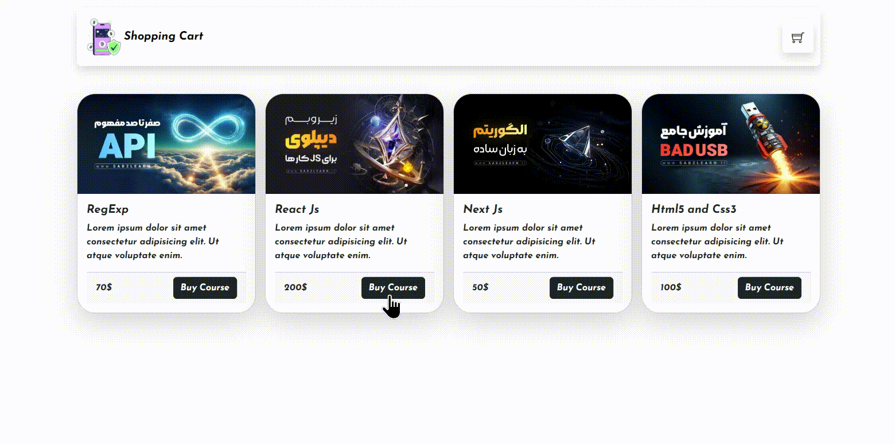

# <p align="center"> Hi there 👋 I'm Mohammad Hossein 👨‍💻 </p>
<p align="center"> React Js expert and FrontEnd Developer from Iran.</p>

## Description Project
- A beautiful shopping cart

>### Languages
>> 
>>
>> 
>> 
>> 
>> 
>> 

>### Packages
>> 
>> 
>> 
>> 
>> 
>> 
>> 

>### Development Environment

>> 

## View of the project



## Getting Started

First of all, you need to have the Node.Js installed on your system before you see these links. 

>[node js](https://nodejs.org/en/download)

Before running the project, you need to have npm installed on your system, then you can set the following commands in the project path.

If you have node.js installed it will automatically install npm

We used mongoDB database in this project before running the project, if you do not have it installed on your system, refer to this link 
> [mongoDB](https://www.mongodb.com/try/download/compass)

After ensuring the installation of the mentioned items, enter the following commands in the direction of the project.

>### Step-1
>>
>>Open a new terminal on the main path of the project and then enter this command
>>
>```
> cd backend
>```
>>
>>Then install the corresponding packages with the following command
>>
>```
> backend > npm i
>```
>>
>>After installing the packages, enter the following command to run the project backend
>>
>```
> backend > npm start
>```
>>
>### Step-2
>>
>>Open a new terminal on the main path of the project and then enter this command
>>
>```
> cd frontend
>```
>>
>>Then install the corresponding packages with the following command
>>
>```
> frontend > npm i
>```
>>
>>After installing the packages, enter the following command to run the project backend
>>
>```
> frontend > npm run dev
>```
>>
>### Step-3
>>
>>Runs the app in the development mode.\
>>Open [http://localhost:5173](http://localhost:5173) to view it in your browser.
>>
>>The page will reload when you make changes.\
>>You may also see any lint errors in the console.
>>
___
>### Social Network
> [](https://github.com/khadem-mh)
> [](https://pinterest.com/khadem_mh)
> [](https://t.me/mhkhadem)
> [](https://wa.me/989031335939)
> [](https://wakatime.com/@khadem_mh)
